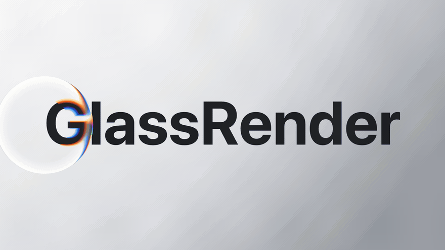
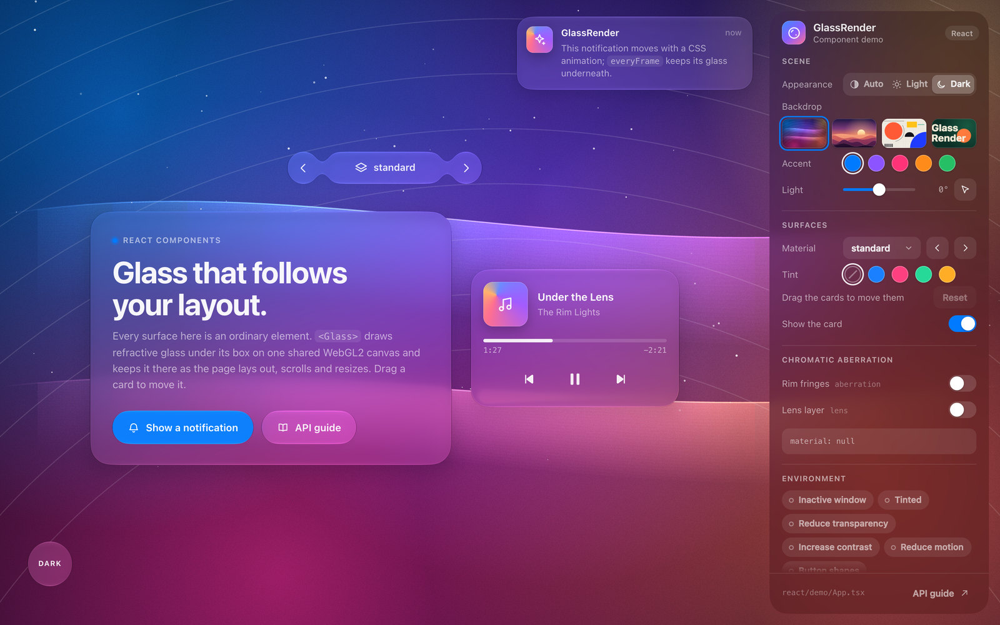
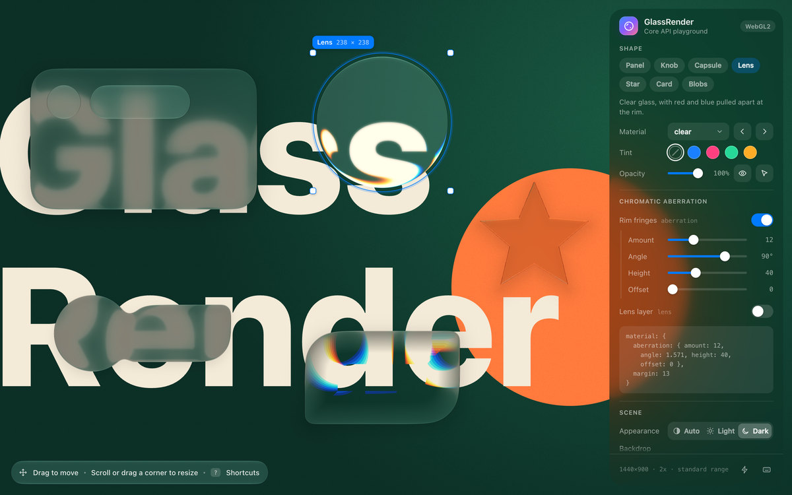
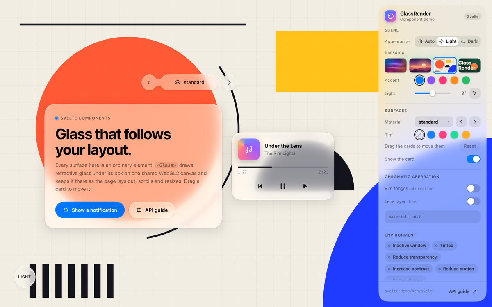

<div align="center">



<br>

**Real-time refractive glass for the web, drawn on a WebGL2 canvas.**

Blur, refraction, rim light, shadow and colour fringes over any image, canvas or video,<br>
with React, Svelte and Vue components that keep the glass under your layout.

[](package.json)
[](#browser-support)
[](src)
[](package.json)
[](LICENSE)

[Quick start](#quick-start) · [Showcase](#showcase) · [Frameworks](#frameworks) · [Demos](#demos) · [API guide](api.md)

</div>

## Features

- **Refraction, blur and light.** Every pixel of glass refracts, blurs and lights the backdrop you supply: an image, a canvas or a playing video.
- **29 materials.** `standard`, `clear`, `prominent`, `menu`, `sidebar`, `dock`, `widget` and more, each adapting to its size, to light or dark, and to the surroundings.
- **Glass that follows the DOM.** `Glass` components for React, Svelte and Vue track their boxes as the page lays out, scrolls, resizes and animates.
- **Groups and masks.** Neighbouring shapes flow into one piece of glass, and any alpha mask becomes an outline.
- **Chromatic aberration.** Rim fringes and a lens layer, tunable on any material.
- **Accessibility settings.** Follows reduced transparency, increased contrast and reduced motion, or set them yourself.
- **No runtime dependencies.** One WebGL2 context, recovery from context loss, and extended-range output on HDR screens.

## Showcase



<p align="center"><sub><b>Component demo</b>: glass under ordinary DOM boxes, a toolbar that merges, cards you can drag, and a notification moved by CSS</sub></p>

<table>
<tr>
<td width="50%"></td>
<td width="50%"></td>
</tr>
<tr>
<td align="center"><sub><b>Core playground</b>: shapes, materials and colour fringes</sub></td>
<td align="center"><sub><b>Light appearance</b>: the same demo in Svelte</sub></td>
</tr>
</table>

## Quick start

GlassRender is built from this repository. You need Node.js 22.12 or later and npm:

```sh
git clone https://github.com/Feralthedogg/GlassRender
cd GlassRender
npm ci
npm run build    # builds the core into dist/
npm run demo     # serves the examples at http://127.0.0.1:5173/examples/
```

Then draw glass on a canvas of your own:

```js
import { createGlass } from "glassrender";

// The picture the glass refracts: an image, a canvas or a video.
const made = createGlass(document.querySelector("canvas"), { backdrop: image });
if (!made.ok) throw new Error(made.error);

const glass = made.value;
const panel = glass.add({ x: 40, y: 40, width: 320, height: 160, radius: 24, preset: "standard" });

// set() changes only what you pass and schedules the next frame.
panel.set({ tint: [0.2, 0.6, 1, 0.2] });
```

Coordinates are CSS pixels from the top-left corner of the canvas. The backdrop is yours to supply: GlassRender does not capture the page behind the canvas.

<details>
<summary><b>The complete page</b>, <code>examples/quick-start.html</code></summary>
<br>

```html
<!doctype html>
<html lang="en">
<head>
    <meta charset="utf-8">
    <meta name="viewport" content="width=device-width, initial-scale=1">
    <link rel="icon" href="data:,">
    <title>GlassRender browser quick start</title>
    <style>
        body { margin: 0; }
        canvas { display: block; width: 100vw; height: 100vh; }
    </style>
</head>
<body>
    <canvas id="glass"></canvas>
    <script type="module">
        import { createGlass } from "../dist/index.js";

        const backdrop = "data:image/svg+xml," + encodeURIComponent(
            '<svg xmlns="http://www.w3.org/2000/svg" width="1200" height="800">' +
            '<rect width="1200" height="800" fill="#163350"/>' +
            '<circle cx="350" cy="300" r="260" fill="#7960e8"/>' +
            '<path d="M0 600L1200 200V800H0Z" fill="#e58c53"/>' +
            '<path d="M0 0L1200 800M0 200L900 800" stroke="white" stroke-width="24"/>' +
            '</svg>'
        );
        const image = new Image();
        image.src = backdrop;
        await image.decode();

        const canvas = document.getElementById("glass");
        const result = createGlass(canvas, { backdrop: image });
        if (!result.ok) throw new Error(result.error);

        const glass = result.value;
        const panel = glass.add({
            x: 40, y: 40, width: 320, height: 160,
            radius: 24, preset: "standard",
        });
        panel.set({ x: 64 });
        window.addEventListener("pagehide", () => glass.destroy(), { once: true });
    </script>
</body>
</html>
```

Serve it over HTTP: run `npm run demo` and open http://127.0.0.1:5173/examples/quick-start.html.

</details>

Every option, the presets, groups, masks, custom materials and the low-level renderer are described in the **[API guide](api.md)**.

## Frameworks

| Package | Version | Requires |
| --- | --- | --- |
| [`glassrender-react`](react) | 0.2.0 | React 18 or later |
| [`glassrender-svelte`](svelte) | 0.4.0 | Svelte 5 |
| [`glassrender-vue`](vue) | 0.2.0 | Vue 3.4 or later |

The three adapters share one model. `GlassCanvas` owns the canvas and the render loop, each `Glass` inside it draws glass under its own box, and `GlassGroup` merges the boxes inside it into one piece of glass. With `fixed={false}` (`:fixed="false"` in Vue), the canvas stays inside a container of your own size.

Build the core first (see [Quick start](#quick-start)), then run the commands of your framework from the repository root.

<details open>
<summary><b>React</b></summary>
<br>

```sh
npm --prefix react ci
npm --prefix react run build
npm --prefix react run demo -- --host 127.0.0.1 --strictPort
```

Open http://127.0.0.1:5175/quick-start.html, or http://127.0.0.1:5175/ for the full demo. `react/demo/quick-start.html` provides `#app` and loads `react/demo/quick-start.tsx`:

```tsx
import { StrictMode } from "react";
import { createRoot } from "react-dom/client";
import { Glass, GlassCanvas } from "glassrender-react";

const backdrop = "data:image/svg+xml," + encodeURIComponent(
    '<svg xmlns="http://www.w3.org/2000/svg" width="1200" height="800">' +
    '<rect width="1200" height="800" fill="#163350"/>' +
    '<circle cx="350" cy="300" r="260" fill="#7960e8"/>' +
    '<path d="M0 600L1200 200V800H0Z" fill="#e58c53"/>' +
    '<path d="M0 0L1200 800M0 200L900 800" stroke="white" stroke-width="24"/>' +
    '</svg>'
);

function App() {
    return (
        <GlassCanvas backdrop={backdrop}>
            <main style={{ minHeight: "100vh", display: "grid", placeItems: "center" }}>
                <Glass preset="standard" radius={24} style={{ width: 320, padding: 32 }}>
                    <h1>GlassRender</h1>
                    <p>React local package example.</p>
                </Glass>
            </main>
        </GlassCanvas>
    );
}

const container = document.getElementById("app");
if (!container) throw new Error("The #app element is missing.");
createRoot(container).render(<StrictMode><App /></StrictMode>);
```

</details>

<details>
<summary><b>Svelte</b></summary>
<br>

```sh
npm --prefix svelte ci
npm --prefix svelte run package
npm --prefix svelte run demo -- --host 127.0.0.1 --strictPort
```

Open http://127.0.0.1:5174/quick-start.html, or http://127.0.0.1:5174/ for the full demo. `svelte/demo/quick-start.html` provides `#app`, and its entry point mounts `svelte/demo/QuickStart.svelte`:

```ts
import { mount } from "svelte";
import QuickStart from "./QuickStart.svelte";

const target = document.getElementById("app");
if (!target) throw new Error("The #app element is missing.");
mount(QuickStart, { target });
```

```svelte
<script lang="ts">
    import { Glass, GlassCanvas } from "glassrender-svelte";

    const backdrop = "data:image/svg+xml," + encodeURIComponent(
        '<svg xmlns="http://www.w3.org/2000/svg" width="1200" height="800">' +
        '<rect width="1200" height="800" fill="#163350"/>' +
        '<circle cx="350" cy="300" r="260" fill="#7960e8"/>' +
        '<path d="M0 600L1200 200V800H0Z" fill="#e58c53"/>' +
        '<path d="M0 0L1200 800M0 200L900 800" stroke="white" stroke-width="24"/>' +
        '</svg>'
    );
</script>

<GlassCanvas {backdrop}>
    <main style="min-height: 100vh; display: grid; place-items: center;">
        <Glass preset="standard" radius={24} style="width: 320px; padding: 32px;">
            <h1>GlassRender</h1>
            <p>Svelte local package example.</p>
        </Glass>
    </main>
</GlassCanvas>
```

</details>

<details>
<summary><b>Vue</b></summary>
<br>

```sh
npm --prefix vue ci
npm --prefix vue run build
npm --prefix vue run demo -- --host 127.0.0.1 --strictPort
```

Open http://127.0.0.1:5176/quick-start.html, or http://127.0.0.1:5176/ for the full demo. `vue/demo/quick-start.html` provides `#app`, and its entry point mounts `vue/demo/QuickStart.vue`:

```ts
import { createApp } from "vue";
import QuickStart from "./QuickStart.vue";

createApp(QuickStart).mount("#app");
```

```vue
<script setup lang="ts">
import { Glass, GlassCanvas } from "glassrender-vue";

const backdrop = "data:image/svg+xml," + encodeURIComponent(
    '<svg xmlns="http://www.w3.org/2000/svg" width="1200" height="800">' +
    '<rect width="1200" height="800" fill="#163350"/>' +
    '<circle cx="350" cy="300" r="260" fill="#7960e8"/>' +
    '<path d="M0 600L1200 200V800H0Z" fill="#e58c53"/>' +
    '<path d="M0 0L1200 800M0 200L900 800" stroke="white" stroke-width="24"/>' +
    '</svg>'
);
</script>

<template>
    <GlassCanvas :backdrop="backdrop">
        <main style="min-height: 100vh; display: grid; place-items: center;">
            <Glass preset="standard" :radius="24" style="width: 320px; padding: 32px;">
                <h1>GlassRender</h1>
                <p>Vue local package example.</p>
            </Glass>
        </main>
    </GlassCanvas>
</template>
```

</details>

## Demos

| Demo | Source | Address |
| --- | --- | --- |
| Core playground | [`examples/index.html`](examples/index.html) | http://127.0.0.1:5173/examples/ |
| React | [`react/demo/App.tsx`](react/demo/App.tsx) | http://127.0.0.1:5175/ |
| Svelte | [`svelte/demo/App.svelte`](svelte/demo/App.svelte) | http://127.0.0.1:5174/ |
| Vue | [`vue/demo/App.vue`](vue/demo/App.vue) | http://127.0.0.1:5176/ |

The playground has every shape kind, preset, environment setting and chromatic aberration control of the core API. The component demos show the same page in each framework, with cards you can drag around. Start them with the commands above.

## Install into an existing app

Create the core archive and the archive of your adapter in this checkout. Each adapter command installs the adapter's dependencies and builds it before packing:

```sh
npm pack                            # glassrender-0.6.0.tgz
(cd react && npm ci && npm pack)    # react/glassrender-react-0.2.0.tgz
(cd svelte && npm ci && npm pack)   # svelte/glassrender-svelte-0.4.0.tgz
(cd vue && npm ci && npm pack)      # vue/glassrender-vue-0.2.0.tgz
```

Then install the core together with your adapter, from an app next to the `GlassRender` directory:

```sh
# React
npm install ../GlassRender/glassrender-0.6.0.tgz ../GlassRender/react/glassrender-react-0.2.0.tgz

# Svelte
npm install ../GlassRender/glassrender-0.6.0.tgz ../GlassRender/svelte/glassrender-svelte-0.4.0.tgz

# Vue
npm install ../GlassRender/glassrender-0.6.0.tgz ../GlassRender/vue/glassrender-vue-0.2.0.tgz
```

The framework itself must already be installed in the app. Keep your entry point and import `GlassCanvas` and `Glass` as in the examples above.

## Project layout

```text
src/        the engine: materials, presets, the WebGL2 renderer and createGlass
react/      glassrender-react, with its demo in react/demo
svelte/     glassrender-svelte, with its demo in svelte/demo
vue/        glassrender-vue, with its demo in vue/demo
examples/   the core playground, the quick start and the assets the demos share
api.md      the API guide
```

## Browser support

GlassRender runs wherever WebGL2 does. Mask outlines need `EXT_color_buffer_float`, and extended-range output needs a screen and a browser that support it. When WebGL2 is missing, `createGlass` returns an error instead of throwing.

## License

[MIT](LICENSE) © 2026 Feralthedogg
